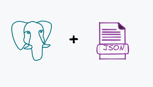
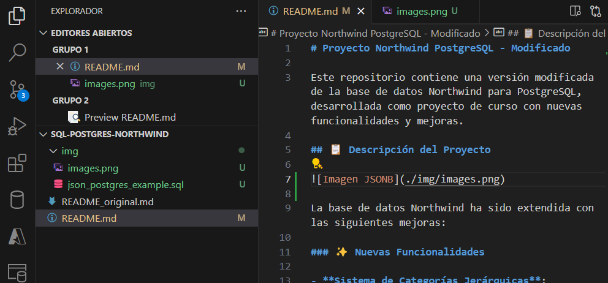

# Proyecto Northwind PostgreSQL - Modificado

Este repositorio contiene una versión modificada de la base de datos Northwind para PostgreSQL, desarrollada como proyecto de curso con nuevas funcionalidades y mejoras.

## 📋 Descripción del Proyecto




La base de datos Northwind ha sido extendida con las siguientes mejoras:

### ✨ Nuevas Funcionalidades

- **Sistema de Categorías Jerárquicas**: Subcategorías para mejor organización
- **vuestra modificación**

## 🛠️ Tecnologías

- **PostgreSQL** 12+ 
- **pgAdmin** (opcional)
- **SQL Dump** para instalación rápida

## 📁 Estructura del Repositorio

```
northwind-postgres-modificado/
├── README.md                          # Este archivo
├── northwind_modificado.sql           # ⭐ DUMP COMPLETO DE LA BD
├── docs/
│   ├── INSTALACION.md                 # Guía de instalación
│   ├── FUNCIONALIDADES.md             # Documentación de mejoras
│   └── CONSULTAS_EJEMPLO.md           # Ejemplos de uso
└── img/
    ├── iagrama_er.png                # Diagrama actualizado
    └── consultas_ejemplo.png          # Capturas de pantalla
```

## 🚀 Instalación Rápida

### Prerrequisitos
- PostgreSQL 12 o superior
- Cliente psql o pgAdmin

### Instalación en 3 pasos

1. **Clonar repositorio**
```bash
git clone https://github.com/tu-usuario/northwind-postgres-modificado.git
cd northwind-postgres-modificado
```

2. **Crear base de datos**
```bash
createdb northwind_curso
```

3. **Restaurar dump completo**
```bash
psql -d northwind_curso -f northwind_modificado.sql
```

¡Y listo! La base de datos estará completamente configurada con datos de ejemplo.

### Alternativa con pgAdmin
1. Crear nueva base de datos llamada `northwind_curso`
2. Click derecho → Restore
3. Seleccionar archivo `northwind_modificado.sql`
4. Ejecutar

## 🔍 Funcionalidades Principales

### 1. Modificación de la tabla Products

Objetivo: Añadir un campo JSON para almacenar atributos dinámicos de productos (ej: especificaciones técnicas, metadatos).

1. Añadir la columna caracteristicas_json en la tabla Products.
2. Rellenar la nueva columna con datos JSON
Insertar ejemplos con valores específicos de "categoria" y "subcategoria".
3. Ejecutar consultas sobre los datos JSON
    Obtener productos de una categoría específica.
    Filtrar productos según una subcategoría dentro del JSON.


### 2. Control de Stock Inteligente
```sql
-- Ver productos con stock bajo
SELECT * FROM productos_stock_bajo;
```


### 3. Propuesta del alumno

Incluye aquí tu propuesta
................


## 📊 Nuevas Tablas Añadidas 

- `subcategories` - Categorías jerárquicas
- `volume_discounts` - Descuentos por cantidad
- `product_audit` - Auditoría de cambios
- `stock_alerts` - Alertas de inventario

## 📈 Vistas Creadas

- `productos_stock_bajo` - Control de inventario
- `ventas_mensuales` - Análisis temporal
- `top_productos_vendidos` - Ranking de productos
- `analisis_clientes` - Segmentación de clientes

## 🔧 Funciones y Triggers

- **Auditoría automática** en cambios de productos
- **Alertas de stock** cuando baja del mínimo
- **Cálculo de descuentos** por volumen de compra
- **Actualización automática** de timestamps

## 📝 Datos de Prueba

El dump incluye:
- Base Northwind completa original
- 8 subcategorías de ejemplo
- 8 reglas de descuento por volumen
- Configuración de stock mínimo
- Alertas de ejemplo generadas

## 🧪 Validar Instalación

Después de restaurar, ejecuta estas consultas para verificar:

```sql
-- Verificar nuevas tablas
SELECT count(*) FROM subcategories;        -- Debe mostrar 8
SELECT count(*) FROM volume_discounts;     -- Debe mostrar 8
SELECT count(*) FROM stock_alerts;        -- Debe mostrar varias

-- Probar vistas
SELECT count(*) FROM productos_stock_bajo;
SELECT count(*) FROM ventas_mensuales;

-- Probar función
SELECT calcular_descuento_volumen(1, 100);  -- Debe mostrar 10.00
```

## 📋 Especificaciones Técnicas

- **Versión PostgreSQL**: 12+
- **Tamaño del dump**: ~500KB
- **Total tablas**: 17 (13 originales + 4 nuevas)
- **Total vistas**: 4
- **Total funciones**: 3
- **Triggers**: 1 principal con múltiples eventos

## 👨‍🎓 Información Académica

- **Curso**: Bases de Datos Avanzadas
- **Institución**: [Tu Institución]
- **Autor**: [Tu Nombre]
- **Fecha**: Mayo 2025

## 📞 Soporte

Si tienes problemas con la instalación:

1. Verifica que PostgreSQL esté corriendo
2. Asegúrate de tener permisos para crear BD
3. Revisa que el archivo SQL esté completo
4. Consulta los logs de PostgreSQL para errores

## 🎯 Objetivos de Aprendizaje Demostrados

- ✅ Modificación de esquemas existentes
- ✅ Creación de tablas relacionadas
- ✅ Implementación de triggers
- ✅ Desarrollo de vistas complejas
- ✅ Funciones en PL/pgSQL
- ✅ Optimización con índices
- ✅ Sistemas de auditoría
- ✅ Generación de dumps

---

**Nota**: Este proyecto demuestra conocimientos avanzados en PostgreSQL aplicados sobre la conocida base de datos Northwind, añadiendo funcionalidades empresariales reales.

```sql
CREATE TABLE cliente
```

